# Design for Developers 101

You came to Juno to become a developer, so you might be asking why are we learning about design?

Yes we understand that you are here to become developers not designers. We don't need you to come out of the bootcamp as experts in design. In fact when you get a real development job, you will not be expected to know how to design. However development and design go hand in hand. Developers are constantly in communication with designers and other members on the team. Being able to understand the basics and talk about design is a super valuable skill to have alongside development skills and it will make you a better developer.

Making design mistakes in your projects and portfolio can actually make you look like an incapable developer. 

You will also be in charge of designing your projects in the upcoming weeks of bootcamp. We need all your projects to look as polished as possible because no potential employers wants to look at a ugly project with horrible UI! The goal for this lesson is to help you achieve that. 

> It takes about 50 milliseconds for visitors to form an opinion about your website; whether they like it or not, whether they'll stay or leave. In addition, first impressions are mostly design-related." 
> Shopify, 10 Tips for Building a Beautiful Web Developer Portfolio

After all we don't want your site to become something like this...
🔗 [https://www.lingscars.com/](https://www.lingscars.com/)

This is a guide on how you can get started with making design choices and avoid common mistakes!

## 1. Defining the purpose

The first and foremost thing to consider when you are getting started with your project is asking yourself these questions:
1. What is the project?
2. What purpose does it serve? 
3. Who is the target audience? 

Having these questions answered will eventually help define the tone and personality of the project, making it much easier to make design decisions in the future.

Let's use a trivia app as an example.
1. A trivia game that contains questions from different categories
2. Providing entertainment for family/friends gatherings
3. Family members of all ages, friends. 

It is also very important to have the purpose of your project clearly stated upon first landing on it. The user needs to know what the application or site is about when they land before they would like to invest any more of their time on the site further. 

🔗 **[Have a look at this site here](http://rottencode.herokuapp.com/)**

Would you want to interact with this site?

## 2. Choosing a colour palette

After you've defined the purpose and tone of your project, making colour choices will be a lot easier! Your site should follow a consistent colour scheme throughout the site. Pre-defining a colour palette in your planning will simplify your building process. 

You don't need to understand colour theory to create a colour palette, there are lots of tools to help you out with it!

- **[Coolors](https://coolors.co/)**
- **[Color Hunt](https://colorhunt.co/)**
- **[ColorSpace](https://mycolor.space/)**

### Colour palette formula 🔥
The safest and simplest option to start creating a colour palette is to choose 5 colours: 
- **White or a very light grey (#FAFAFA)**
  A standard white is always needed mainly as the basic background colour of your website. 
- **Black or a very dark grey (#232323)**
  For paragraphs and text.
- **Primary colour**
  The main colour that determines the overall look of the project. This colour will define the brand, personality and tone of your project. It can be used as background colours for sections, headings or buttons. 
- **Secondary colour**
  Having one main colour is boring! We will need to pick a second colour to add visual interest. This could be used for alternative background colours, buttons, CTAs, links and highlight tags. 
- **Supporting accent colours**
  Your project might need extra supporting accent colours that could be used for highlights, alert or warning messages. 

[Here's great article about building a successful colour palette.](https://refactoringui.com/previews/building-your-color-palette/)

If you are unsure how to choose your primary colour and secondary colour. Look to the purpose of your project for inspiration. 

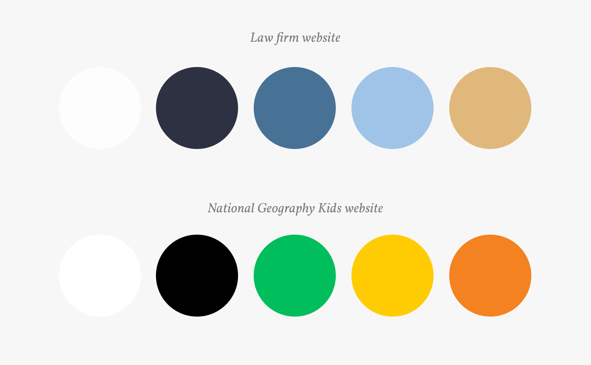

Once you've chosen a colour palette, stick to it and use those colours throughout the whole project!

_**Very important accessibility Note!**_
In order to meet the [WCAG AA compliance standard](https://github.com/HackerYou/bootcamp-notes/blob/master/accessibility/accessibility-and-css.md), you have to make sure the colour combination you are using between your regular text and the background have a **contrast ratio of 4.5:1**. You can use tools like [Color Safe Color Generator](http://colorsafe.co/) or [Text on Background Image Contrast Checker](https://www.brandwood.com/a11y/) to check contrast ratios.

🔗 [Cool Example](http://vibrant.pratheev.com/) 👍

## 3. Choosing Fonts

Like colours, different fonts can convey different meanings. The most important thing when it comes to choosing fonts is to make sure that they are:
- **Appropriate for the project's purpose**
- **Legible for everyone!**

Think about the content of your site, what your site is about and the mood that it should convey. A font can be classic, artistic, youthful, modern etc. 

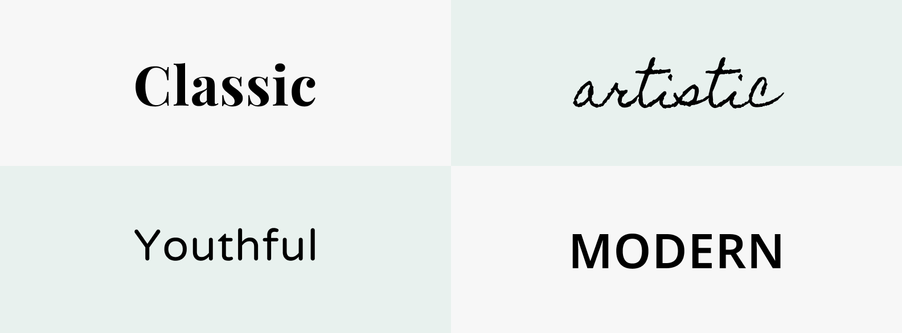

### Serif vs. Sans Serif

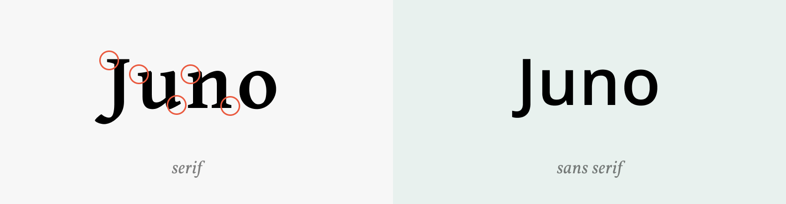

It is common to use more than one font for a project. Like colours, designers choose a second font or even a third font to add visual variety. However there should be **no more than three**! If you have more than three fonts, the project can look messy and inconsistent. The typical recommendation would be to **choose two fonts - a heading font and a body text font**. We call this *font pairing*.

### Font pairing tips 🔥

- Keep elaborate and unconventional fonts for headings, as headings are generally short and should be eye-catching visually. 
- Sans-serif fonts are usually recommended for body text as they are easier to read on the screen, but it's not a super hard rule, many serif fonts could work great as body text as well. 
- If your heading font is elaborate, choose a simpler body font. If your heading font is simpler you can choose a more interesting body font, but again keep in mind that body font needs to be legible!
- One of the easiest way to pair fonts while keeping visual interest is to pair a serif font with a sans-serif font.
- **Bulletproof 🔥 Tip**: Just choose a font pairing combination from [fontpair.co](https://fontpair.co/) or [ultimate google font pairings](https://www.reliablepsd.com/ultimate-google-font-pairings/) that speaks to you and your project!


## 4. Typography

Once you've chosen your fonts, it is important that they are easy to read! 90% of the information on the web is conveyed through typography. Here are some best practices and general rules to follow to help your users better process and read texts!

### Line Height

Line height is the height of a line of text, and it determines the distance between multiple lines of text. Tightly spaced lines of text can appear difficult to read for the user. However too generously spaced lines of text can make each line look like separate elements.

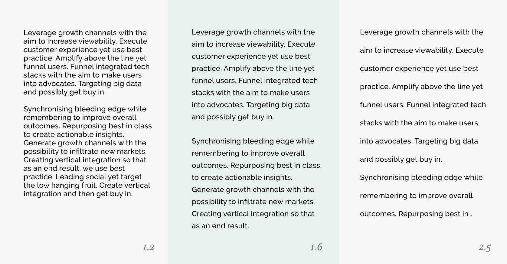

**The general rule is to aim for your line height to be about 60% - 80% larger than the font size.** The number can vary depending on the font and font size. 

You can do this by providing a unit-less value to the `line-height` property. 

```css
p {
  font-size: 16px;
  line-height: 1.6;
}
```

Browser's default line height is around 1.2, 1.6 is usually a good place to start. 

### Length

Let's be honest, nobody is interested in consuming long paragraphs. Break up key points into smaller paragraphs of sentences will make your content more approachable and digestible for readers. 

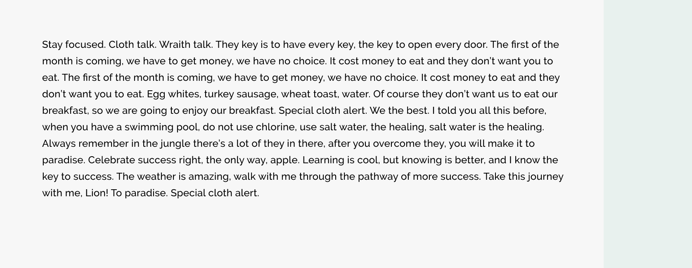
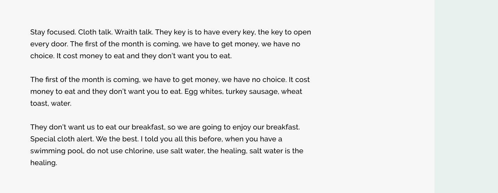

You also want to make sure your text paragraph does not stretch for too long on the horizontal line. It is tiring for users to read a long line of text. 

**Try to limit line length to be no longer than 85 characters.**

Setting a maximum width on paragraphs is generally a good idea. The wrapper container also helps with this as well.
If you feel like there is too much blank space, consider splitting the content into columns.  

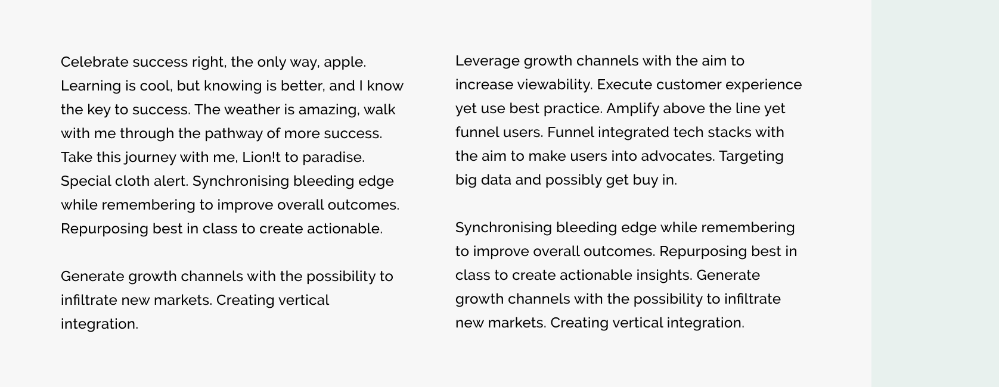

### Alignment

Text alignment should always default to left aligned. Our eyes like following the same patterns. Left aligned is the easiest pattern to follow because we are always jumping back to the same spot when it goes to the next line. 

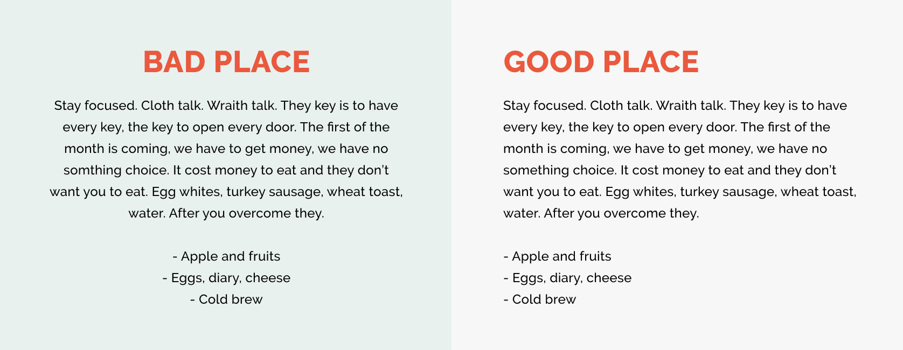

However it is okay to experiment with other types of alignment in situations where the text is short such as in a subheading. 

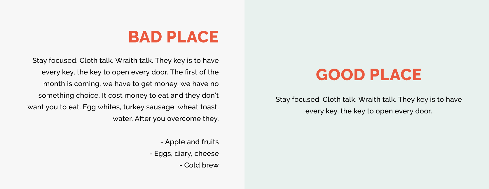

### Text Hierarchy 

Contrast is our friend! It is important for us to create visual hierarchy with our content. Visual hierarchy helps us direct user flow to the order of importance. This can be achieved by adjusting css properties like `font-size`, `font-weight` and `color`/`background-color`. 

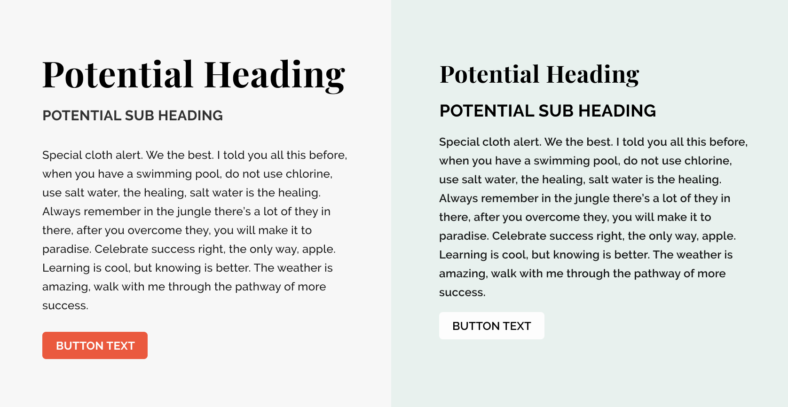

## 5. Buttons

Buttons are considered as a major and essential UI element for all sites and applications. They are sometimes referred to as *CTA (call to action)*, which is meant to prompt user interaction. Therefore, they are usually styled to bring visual attention, usually with a secondary colour or accent colour. 

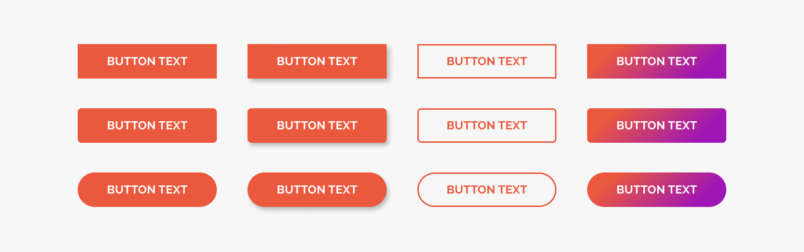

Buttons comes in all varieties of different styles. There are no right and wrong button styles as long as you **stick to one particular style** throughout the entire project and follow these best user experience (UX) practices:

- Buttons should have a descriptive text telling users what they are expected to happen when they click on the button. 

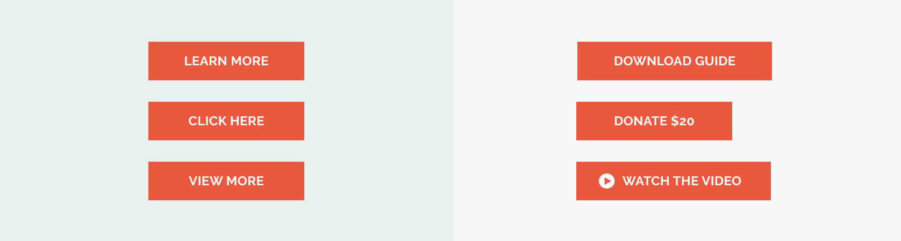

- Buttons should have some padding space around the descriptive text so that use have enough clickable area. 


- Buttons are interactive elements which means we need to ensure their pseudo states are styled. These include `:hover`, `:disabled` and `:active`. These will ensure user gets feedback from the interactivity. 
  🔗 [Play around with this codepen](https://codepen.io/susan8098/pen/YzXovOY), which button is correctly styled?

- Lastly, if it's not a interactive button (aka. if the element doesn't do anything), don't style it like one! It's confusing to the users!

## 6. Imagery & Icons

Imagery and Icons are elements that are responsible for making up a huge percentage of visual interest for your project, which is why is it very important to keep it cohesive, relevant and on brand. 

### Where to find imagery & icons? 

**Photos**
- [Unsplash](https://unsplash.com/)
- [Pexels](https://www.pexels.com/)
- [SplitShire](https://www.splitshire.com/)
- [Foodies Feed](https://www.splitshire.com/)
- [Life of Pix](https://www.lifeofpix.com/)

**Icons**
- [The Noun Project](https://thenounproject.com/)

**Illustrations**
- [unDraw](https://undraw.co/)
- [DrawKit](https://www.drawkit.io/)
- [humaaans](https://www.humaaans.com/)

Everything listed above are open-sourced and royalty-free! Do keep in mind to **give credits** to those who created them wherever you can! 

### What to watch out for when implementing images

- Make sure your images are high quality that aren't pixelated or stretched!


- At the same time you also want to make sure to optimize your images so that they are not over 2MB in size! Large image size are one of the main contributions to low performance speed. You can use tools like [ImageOptim](https://imageoptim.com/mac) or [Kraken.io](https://kraken.io/). 
- Choose images that are relevant to your content and purpose!

- Make sure to choose images that are cohesive in colour palette.

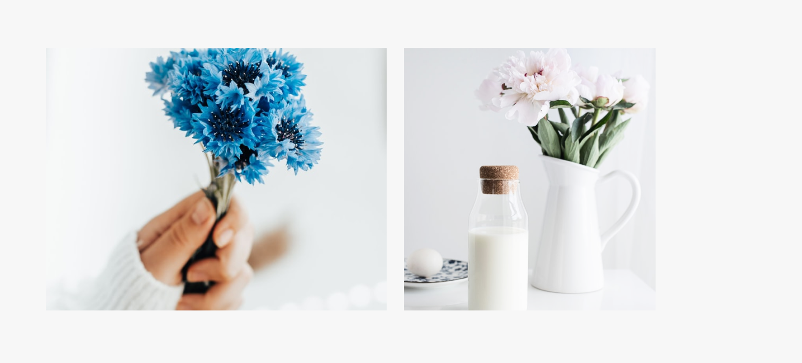

If you are struggling to find cohesive images, a hack you can use is to implement overlays.

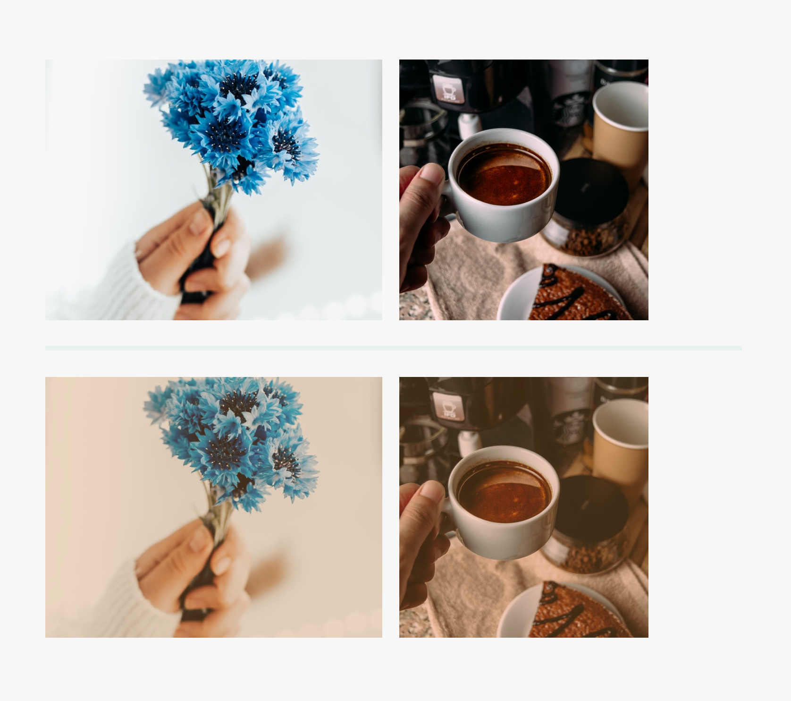

### What to watch out for when implementing icons

Again consistency! All icons in your project needs to maintain consistency in colour, size, line/stroke sizes and treatment.

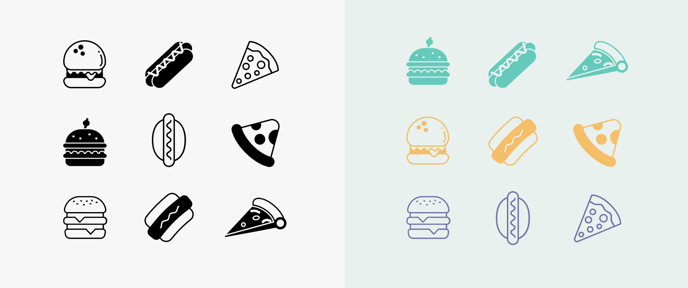

The easiest way to achieve this is just use icons that belongs as a set. Most artist create icons as a set and you can easily find sets on The Noun Project. 

The same goes for illustrations as well. Make sure you are using illustrations from the same artist or set for a cohesive look.

## 7. Layout & Grids

Before you start thinking about the layout of your project, you should have a good idea of what kind of content you will have. You don't have to have a full content and copy written out but a rough idea of what sort of sections you are going to have. From there you can start drawing boxes on a piece of paper, what we referred to as *wireframes*.

It is important to think about user flow when laying down wireframes. What is the most important information the user should see when they land on the page and what's next?

Here's an examples of how one might turn a simple content wireframe into developing a more flushed out first draft design. 

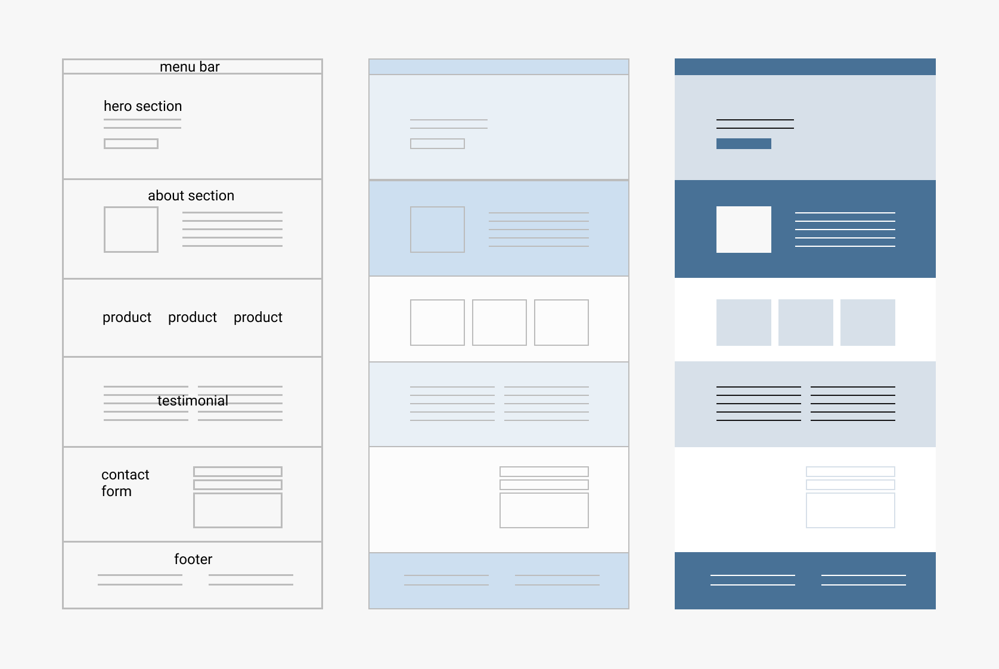

**Segmenting sections**

A trick that web designers often use is to segment sections with different background treatments such as alternative background colours. 


### Alignment

Maintaining consistent alignment is very important to  ensure clean and professional look, but it is often overlooked. Consider the examples below:

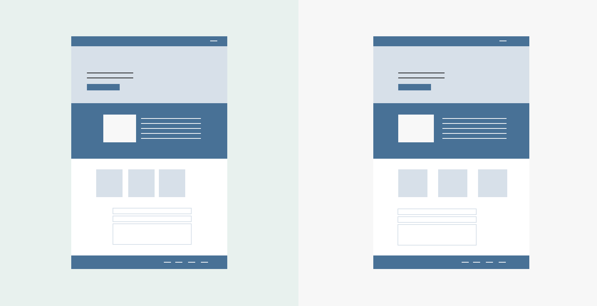

🔗 [Bad example 1](https://kennected.org/) 👎
🔗 [Bad example 2](https://www.studiobyhouse.com/) 👎

Note that this is especially clear along the outer edges of the page. Our eyes like to follow a specific pattern, when elements are out out alignment, it breaks the pattern. This is also why we encourage the use of a *wrapper* or *container*!

🔗 [Good Example](https://bek.is/) 👍

Another common way to ensure elements are aligned consistently is to use a grid system, which we've covered in [this class](https://github.com/HackerYou/bootcamp-notes/blob/master/css/grid-systems.md) before! Essentially a grid is a set of columns that can be placed on top of a page, which you can then use as a guide to place elements on.

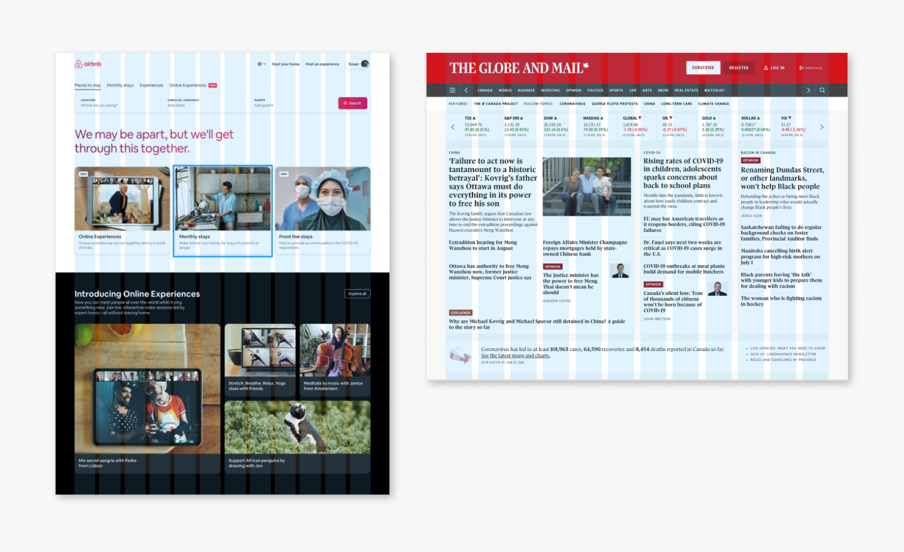

### Whitespace

Whitespace is any blank area between elements. It doesn't have to be white, it could be whatever the background of the area is. Whitespace is important because:

- It provides **visual relief to users' eyes**. If no sufficient whitespace is provided, the page can get very overwhelming to look at and very heavy on users mental strain.
- Whitespace is also **very powerful for directing users'** attention flow. When there is no whitespace, it's very difficult for users to determine what section or content to look at first.

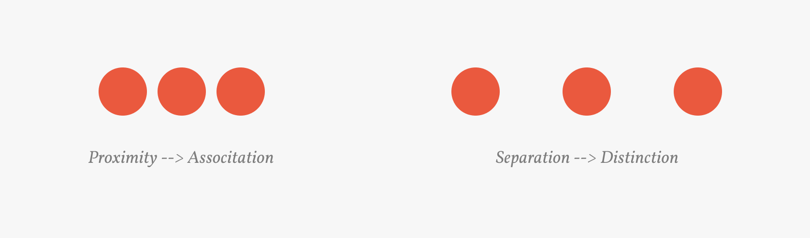

**Paddings & margins** are your best friends when creating spacing between elements. An important point to watch out here is that you are providing consistent spacing between elements. 

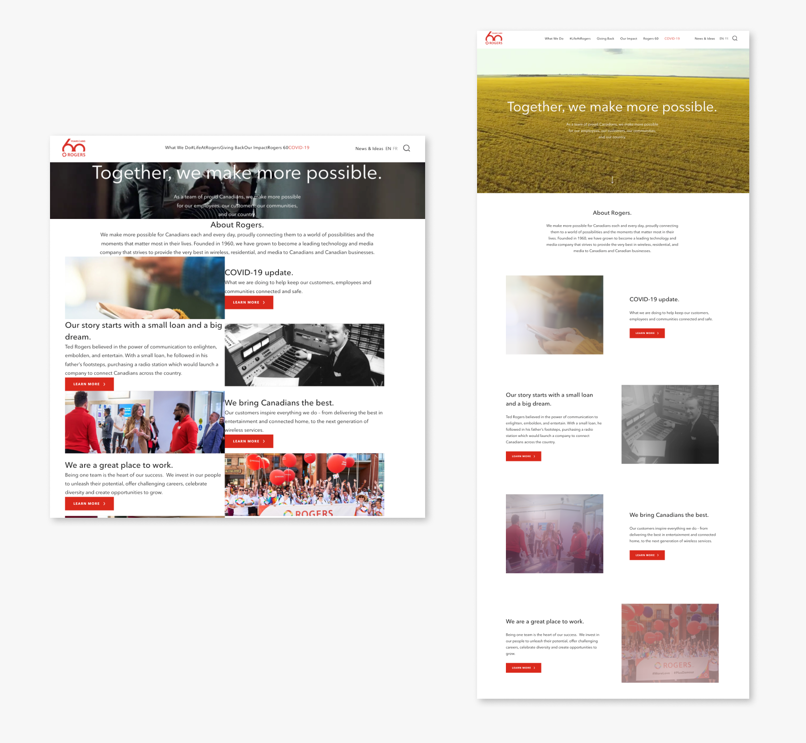

## 8. Responsive optimization

Now that you are going to become front-end developers, you are expected to make your projects' responsive experience as perfect as possible! The goal is that you shouldn't be compromising users' experience just because they are viewing your application on a screen size that is not desktop. This is a chance to show that you have thought about the user experience at every size, a very employable and valuable trait! Refer to the [Responsive Design](https://github.com/HackerYou/bootcamp-notes/blob/master/css/responsive-design.md) and [Cross-browser testing](https://github.com/HackerYou/bootcamp-notes/blob/master/css/cross-browser-testing.md) lessons for how you can achieve this technically. 

### Things to consider...
- Check that your **body text font size** is large enough to read on mobile screens.
- **Heading fonts**, especially `<h1>` and `<h2>` font size usually has to be reduced on mobile so it doesn't take up the entire screen and to avoid horizontal scroll. 
- **Buttons** usually becomes bigger to stretch to 100% width. 
- Check there are no ghost **horizontal scrolls**!
- You may have to **reduce/adjust your spacings** between elements so that they are consistent on mobile experience
- **Unnecessary animation and hover states should be removed**. 
- **You shouldn't be removing any element on mobile!** If you absolutely need to remove element or sections on mobile, you need to think of a way to replicate the same content but for mobile experience. 

🔗 [Bad Example](https://cactuscoding.com/) 👎

🔗 [Good Example](https://pitchfork.com/) 👍

## 9. Creating a style guide for consistency

A style guide is a document **guide that holds all of the information about key visual elements** of a project and how to use them. It's a collection of information about colour palette, typefaces, font sizes, icons, button, spacing, grids and any other visual elements that contributes to the style of the project. Basically everything we've talked about so far documented in a centralized cheatsheet. 

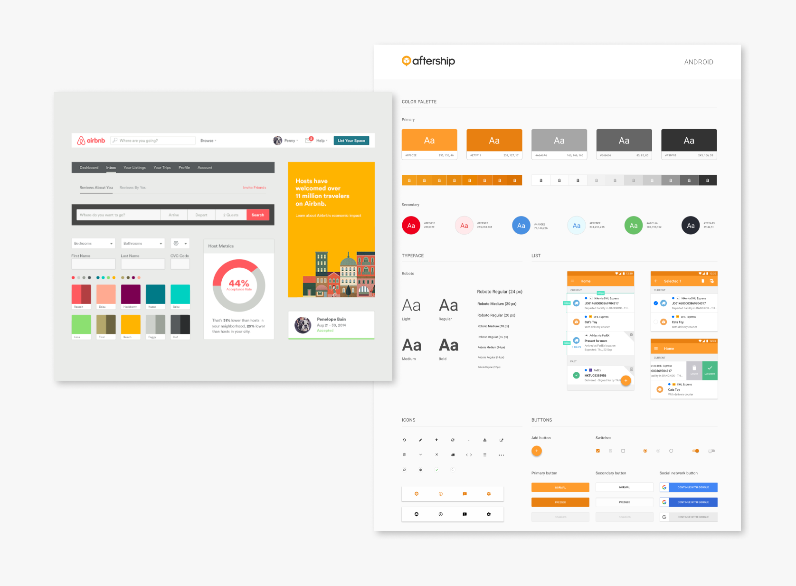

When you start working as a developer, a designer would typically supply a design with a style guide for you to work with. A style guide is especially helpful for a larger project with larger team where there are multiple team members contributing to the design and development of a project. This **ensures consistency and cohesiveness across multiple team members**, avoiding adjustments based on personal preferences. It also makes it a lot easier to make decisions as a team, relieving some of the mental load while working together as a team. 

**Check out these design systems**

- [Airbnb](https://airbnb.design/building-a-visual-language/)
- [IBM](https://www.ibm.com/design/language/color)
- [Mailchimp](https://ux.mailchimp.com/patterns/color)


## 10. UX Considerations

UX stands for User Experience, a term that refers to how the end-user uses or experience a particular product. In our case for web and application development, **good UX means a website/application that is easy, simple, seamless, intuitive and accessible to use for the target audience**. It is not enough for a website or application to appear visually appealing and beautifully designed, if it is counterintuitive and frustrating to use, users will unlikely to return from using the product, which is why good UX is very important but a topic that people often overlooks. 

🔗  [Bad Bad Example](https://userinyerface.com/) 👎

All of our design choices should center around how easy it is for the user to use. It is not to say that visual design is not important, in fact visual design and everything we've talked about in this class is the tool that helps us achieve this goal. For example:

- We've instilled typography rules such as font sizes, line heights, alignment and spacing to make sure that text and content are easy to read for the users.
- Colours choices should be consistent, clear and meet accessibility standards.
- Buttons and CTAs should be very obvious for the user to interact with, and their intentions should be explicit. 

Other considerations include:

- Are animations purposeful? Look at [this example of subtle but purposeful animation](https://christinalaba.com/)
- Are there unnecessary interactive states?
- How many clicks does it take for the users to complete a specific task? 
- Are the website/application instructions direct? 

## Can you identify bad design patterns?
- [Example 1](https://www.diamondsprayfinish.com/)
- [Can't Unseen](https://cantunsee.space/)